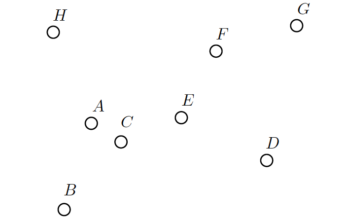

# Convex-Hull

## Introduction
A set S in the plane is called convex if it satises the following property: for every pair of points
p; q 2 S the line segment between them pq is also in the set S (i.e., pq  S).
One problem that comes up time and time again in areas such as computational geometry is the
problem of nding the smallest convex set S which contains all points in some other set X. This set
is called the convex hull of X.
When given some set of points we can describe the convex hull S by listing the points which make up
the vertices in the boundary of the convex hull.

## Tasks
### Part A: Point Orientation
Let p0; p1; p2 be three points in the plane. If p2 is left of the line segment p0p1, then we write
Left(p0; p1; p2). If p2 is right of the line segment p0p1, then we write Right(p0; p1; p2). If three points
are on the same straight line, then we say that (p0; p1; p2) are collinear.
task is to complete the implementation of orientation() in convex-hull.c which takes three
points (p0, p1 and p2) and returns `l' if p2 is Left of p0p1, `r' if p2 is Right of p0p1 or `c' if p0; p1
and p2 are Collinear.
Your function must run in O(1) time.
Hint: check out Appendix A which describes a number of useful vector operations.

### Part B: Checking for Convexity
Let P = (p0,...,pn-1) be a sequence of n points in the Euclidean plane (R2). Assume you have been
given the following algorithm:
```c
function isConvex(p0,..., pn-1)
    for i <- 0 to n - 1 do
        if Right(pi, p(i+1) mod n; p(i+2) mod n) then
            return false
        return true
```
Does the algorithm above correctly determine if P is the boundary of a convex polygon in counter-
clockwise order? Explain your answer.

### Part C: Deque Data Structure
Implement a Deque abstract data structure and complete the denitions of the following functions in
deque.c:
 new deque()
 free deque()
 deque push()
 deque insert()
 deque pop()
 deque remove()
 deque size()
It is up to you to decide on which underlying data structure will be used for your Deque. All of the
operations described above must run in constant (O(1)) time1.

### Part D: Deque Analysis
Explain your deque implementation and the decisions you made. Describe the time complexities of
the four main operations (push, pop, insert, remove) and how these time complexities are achieved.

### Part E: Inside Hull Tracing
Run the following example by hand and provide the points contained in the deque at each step of the
algorithm. Be clear about which end of your deque is the top and which is the bottom.
The points are provided to InsideHull in alphabetic order, starting with point A.

<figure align="center">
  
</figure>

### Part F: Inside Hull Implementation
Implement the C function inside hull() that takes a polygon consisting of n points and computes
the points of its convex hull.
The polygon will be provided as an array of n points named points, and the points will appear in
counter-clockwise order.
Your function should store the points which make up the convex hull in the array hull, which will
have enough memory for at least n points. These points should be stored in counter-clockwise order,
and the rst and last points should not be the same. This will mean the number of points in hull
will be one fewer than the size of the deque C at the end of the algorithm.
The number of points stored in hull should be returned. If an error occurs return INSIDE HULL ERROR.
If three consecutive points are collinear return COLLINEAR POINTS and don't complete the algorithm
(make sure you free any memory you have allocated before you return).
Note: You may assume that the input we will use to test your program will either have collinear points
occurring consecutively or no collinear points at all. Note that the points across the array boundary
(e.g., Polygon[n 􀀀 1]; Polygon[0]; and Polygon[1]) are considered consecutive.

### Part G: Inside Hull Analysis
The best algorithms we have for computing convex hulls for a general set of n points are O(n log n),
if they are not output sensitive.
Identify the basic operations in the InsideHull algorithm and use this to determine the time complexity
of InsideHull, give your answer in Big-Oh notation. Explain how you arrived at this answer.
Does this contradict the statement about runtimes above? Explain why it does or does not.